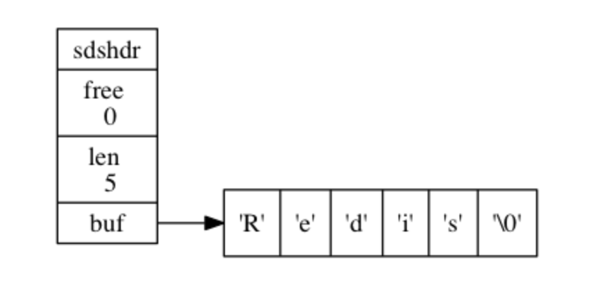

# SDS定义
> ### *语言结构*

```
struct sdshdr {

    // 记录 buf 数组中已使用字节的数量
    // 等于 SDS 所保存字符串的长度
    int len;

    // 记录 buf 数组中未使用字节的数量
    int free;

    // 字节数组，用于保存字符串
    char buf[];

};
```


-------
>### *说明*
*    buf 属性是一个 char 类型的数组， 数组的前五个字节分别保存了 'R' 、 'e' 、 'd' 、 'i' 、 's' 五个字符， 而最后一个字节则保存了空字符 '\0' (SDS 遵循 C 字符串以空字符结尾的惯例[***好处：SDS 可以直接重用一部分 C 字符串函数库里面的函数***])
-------

