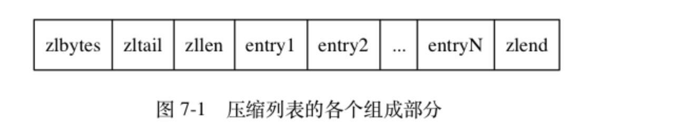

# 压缩列表
> ### 介绍
* 压缩列表（ziplist）是队列键和哈希键的底层实现之一
* 当一个列表键只包含少量列表项， 并且每个列表项要么就是小整数值， 要么就是长度比较短的字符串， 那么 Redis 就会使用压缩列表来做列表键的底层实现
* 当一个哈希键只包含少量键值对， 并且每个键值对的键和值要么就是小整数值， 要么就是长度比较短的字符串， 那么 Redis 就会使用压缩列表来做哈希键的底层实现

-------
> ### 压缩列表构成
* 压缩列表是 Redis 为了节约内存而开发的， 由一系列特殊编码的连续内存块组成的顺序型（sequential）数据结构
* 一个压缩列表可以包含任意多个节点（entry）， 每个节点可以保存一个字节数组或者一个整数值

* zlbytes：记录整个压缩列表占用的内存字节数
* zltail：记录压缩列表表尾节点距离压缩列表的起始地址有多少字节
* zllen：记录了压缩列表包含的节点数量
* entryX：压缩列表包含的各个节点，节点的长度由节点保存的内容决定
* zlend：特殊值 0xFF （十进制 255 ），用于标记压缩列表的末端。

> ### 压缩列表节点的构成
* 每个压缩列表节点可以保存一个字节数组或者一个整数值， 其中， 字节数组可以是以下三种长度的其中一种
    * 长度小于等于 63 （2^{6}-1）字节的字节数
    * 长度小于等于 16383 （2^{14}-1） 字节的字节数组
    * 长度小于等于 4294967295 （2^{32}-1）字节的字节数
* 而整数值则可以是以下六种长度的其中一种
    * 4 位长，介于 0 至 12 之间的无符号整数
    * 1 字节长的有符号整数
    * 3 字节长的有符号整数；
    * int16_t 类型整数
    * int32_t 类型整数
    * int64_t 类型整数 
* 每个压缩列表节点都由 previous_entry_length 、 encoding 、 content 三个部分组成
    * previous_entry_length记录了压缩列表中前一个节点的长度
    * encoding记录了节点的 content 属性所保存数据的类型以及长度
    * content 负责保存节点的值， 节点值可以是一个字节数组或者整数

> ### 连锁更新
* 因为连锁更新在最坏情况下需要对压缩列表执行 N 次空间重分配操作， 而每次空间重分配的最坏复杂度为 O(N) ， 所以连锁更新的最坏复杂度为 O(N^2) 
* 要注意的是， 尽管连锁更新的复杂度较高， 但它真正造成性能问题的几率是很低的：
    * 首先， 压缩列表里要恰好有多个连续的、长度介于 250 字节至 253 字节之间的节点， 连锁更新才有可能被引发， 在实际中， 这种情况并不多见；
    * 其次， 即使出现连锁更新， 但只要被更新的节点数量不多， 就不会对性能造成任何影响： 比如说， 对三五个节点进行连锁更新是绝对不会影响性能的；
-------
> ### 总结
* 压缩列表是一种为节约内存而开发的顺序型数据结构
* 压缩列表被用作列表键和哈希键的底层实现之一
* 压缩列表可以包含多个节点，每个节点可以保存一个字节数组或者整数值
* 添加新节点到压缩列表， 或者从压缩列表中删除节点， 可能会引发连锁更新操作， 但这种操作出现的几率并不高    
 