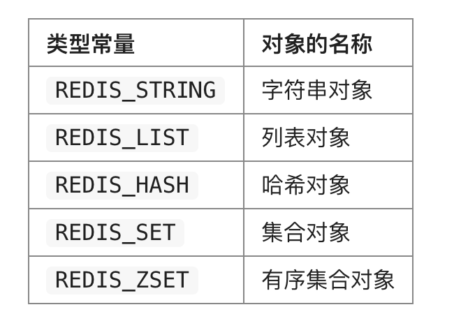
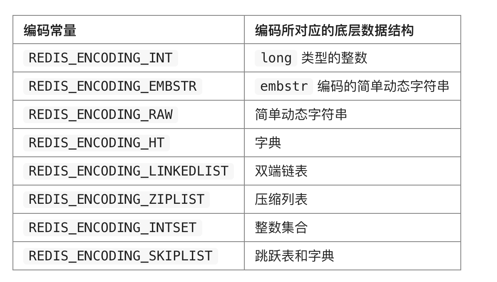
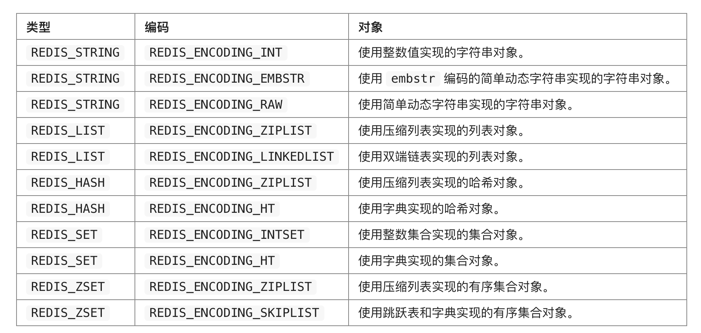
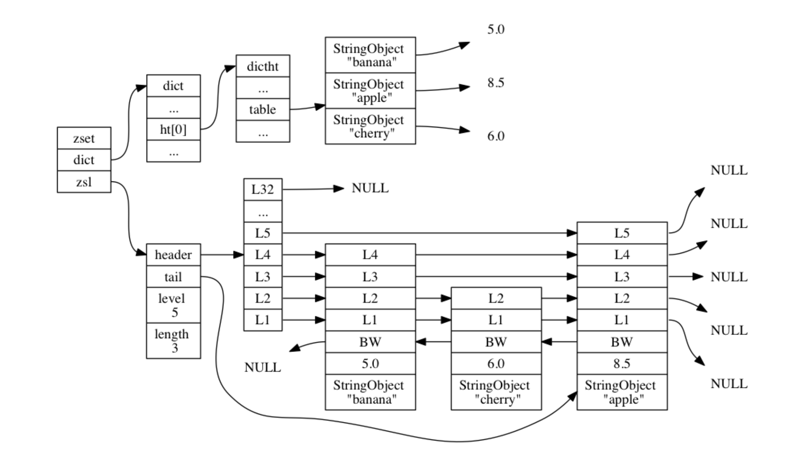

# 对象
> ### 介绍
* 我们陆续介绍了 Redis 用到的所有主要数据结构【简单动态字符串（SDS）、双端链表、字典、压缩列表、整数集合】
* Redis 并没有直接使用这些数据结构来实现键值对数据库，而是基于这些数据结构创建了一个对象系统， 包括
    * 字符串对象
    * 列表对象
    * 哈希对象
    * 集合对象
    * 有序集合对象
* 好处
    * 可以针对不同的使用场景， 为对象设置多种不同的数据结构实现， 从而优化对象在不同场景下的使用效率
    * Redis 的对象系统还实现了基于引用计数技术的内存回收机制
    * Redis 还通过引用计数技术实现了对象共享机制， 这一机制可以在适当的条件下， 通过让多个数据库键共享同一个对象来节约内存 


-------
> ### 对象的类型与编码
#### 提醒
* 每次当我们在 Redis 的数据库中新创建一个键值对时， 我们至少会创建两个对象
    * 一个对象用作键值对的键（键对象）
    * 另一个对象用作键值对的值（值对象）
* Redis 中的每个对象都由一个 redisObject 结构表示，三个属性分别是 type 属性、 encoding 属性和 ptr 属性

```
typedef struct redisObject {

    // 类型
    unsigned type:4;

    // 编码
    unsigned encoding:4;

    // 指向底层实现数据结构的指针
    void *ptr;

    // ...

} robj;
``` 
#### 类型
* 对象的 type 属性记录了对象的类型
* 
* Redis 数据库保存的键值对来说， 键总是一个字符串对象， 而值则可以是字符串对象、列表对象、哈希对象、集合对象或者有序集合对象的其中一种， 因此
    * 当我们称呼一个数据库键为“字符串键”时， 我们指的是“这个数据库键所对应的值为字符串对象”
    * 当我们称呼一个键为“列表键”时， 我们指的是“这个数据库键所对应的值为列表对象”
    * ...

#### 编码和底层实现
* ptr:ptr 指针指向对象的底层实现数据结构
* encoding 属性记录了对象所使用的编码

* 每种类型的对象都至少使用了两种不同的编码


#### 好处
* encoding 属性来设定对象所使用的编码， 而不是为特定类型的对象关联一种固定的编码， 极大地提升了 Redis 的灵活性和效率


-------
> ### 字符串对象【编码：int 、 raw 或者 embstr 】
* 如果一个字符串对象保存的是整数值，字符串对象的编码设置为 int
* 如果字符串对象保存的是一个字符串值， 并且这个字符串值的长度大于 39 字节， 那么字符串对象将使用一个简单动态字符串（SDS）来保存这个字符串值， 并将对象的编码设置为 raw
* 如果字符串对象保存的是一个字符串值， 并且这个字符串值的长度小于等于 39 字节， 那么字符串对象将使用 embstr 编码的方式来保存这个字符串值

-------
> ### 列表对象
> 列表对象的编码可以是 ziplist [压缩列表]或者 linkedlist[双端链表]
* 列表对象使用 ziplist 编码[满足以下两种条件，条件通过配置可以修改]
    * 列表对象保存的所有字符串元素的长度都小于 64 字节
    * 列表对象保存的元素数量小于 512 个
* 当使用 ziplist 编码所需的两个条件的任意一个不能被满足时， 对象的编码转换操作就会被执行： 原本保存在压缩列表里的所有列表元素都会被转移并保存到双端链表里面， 对象的编码也会从 ziplist 变为 linkedlist 


-------
> ### 哈希对象
> 哈希对象的编码可以是 ziplist[压缩列表] 或者 hashtable
* 当哈希对象可以同时满足以下两个条件时， 哈希对象使用 ziplist 编码：
    * 哈希对象保存的所有键值对的键和值的字符串长度都小于 64 字节
    * 哈希对象保存的键值对数量小于 512 个
* 不能满足这两个条件的哈希对象需要使用 hashtable 编码。


-------
> ### 集合对象
> 集合对象的编码可以是 intset[整数集合] 或者 hashtable [字典]
* 当集合对象可以同时满足以下两个条件时， 对象使用 intset 编码
    * 集合对象保存的所有元素都是整数值
    * 集合对象保存的元素数量不超过 512 个
    
-------
> ### 有序集合对象
> 有序集合的编码可以是 ziplist[压缩列表] 或者 skiplist  
> skiplist 编码的有序集合对象使用 zset 结构作为底层实现， 一个 zset 结构同时包含一个字典和一个跳跃表

```
typedef struct zset {

    zskiplist *zsl;

    dict *dict;

} zset;
```
* zset 结构中的 zsl 跳跃表按分值从小到大保存了所有集合元素,过这个跳跃表， 程序可以对有序集合进行范围型操作， 比如 ZRANK 、ZRANGE 等命令就是基于跳跃表 API 来实现的。
* zset 结构中的 dict 字典为有序集合创建了一个从成员到分值的映射,字典中的每个键值对都保存了一个集合元素： 字典的键保存了元素的成员， 而字典的值则保存了元素的分值 [通过这个字典， 程序可以用 O(1) 复杂度查找给定成员的分值]

> #### 为什么有序集合需要同时使用跳跃表和字典来实现
* 在理论上来说， 有序集合可以单独使用字典或者跳跃表的其中一种数据结构来实现， 但无论单独使用字典还是跳跃表， 在性能上对比起同时使用字典和跳跃表都会有所降低
* 因为以上原因， 为了让有序集合的查找和范围型操作都尽可能快地执行， Redis 选择了同时使用字典和跳跃表两种数据结构来实现有序集合。


> #### 编码的转换
* 当有序集合对象可以同时满足以下两个条件时， 对象使用 ziplist 编码
    * 有序集合保存的元素数量小于 128 个
    * 有序集合保存的所有元素成员的长度都小于 64 字节
* 不能满足以上两个条件的有序集合对象将使用 skiplist 编码
* 以上两个条件的上限值是可以修改的 


 